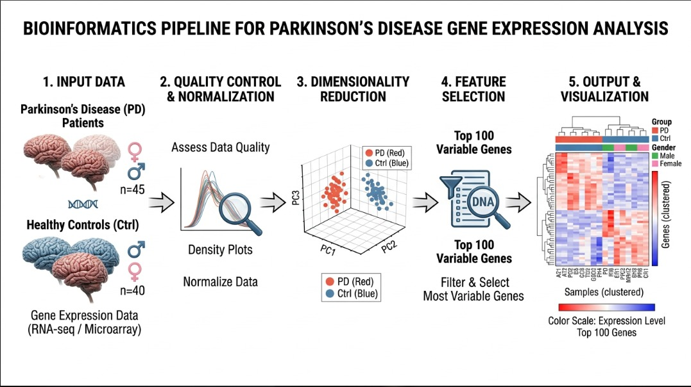

<div align="center">

# 🧬 Parkinson's Disease
## RNA-Seq Exploratory Analysis & Biomarker Discovery

<br/>

[](https://www.r-project.org/)
[](https://bioconductor.org/)
[](LICENSE)
[]()

<br/>

> **Identification of the most transcriptionally variable genes as potential biomarkers for Parkinson's Disease**
> using microarray gene expression data from 19 human brain samples.

<br/>

*Part of the **Multiomics Data Analysis** course — Bioinformatics Diploma Program*

---

</div>

## 📌 Table of Contents

- [Background](#-background)
- [Dataset](#-dataset)
- [Analysis Pipeline](#-analysis-pipeline)
- [Key Results](#-key-results)
- [Repository Structure](#-repository-structure)
- [Requirements](#-requirements)
- [How to Run](#-how-to-run)
- [Output Files](#-output-files)
- [Biological Interpretation](#-biological-interpretation)
- [References](#-references)

---

## 🧠 Background

**Parkinson's Disease (PD)** is the second most prevalent neurodegenerative disorder worldwide, affecting approximately 10 million people. It is characterized by the progressive degeneration of dopaminergic neurons in the *substantia nigra*, leading to motor and non-motor impairments.

Early and accurate diagnosis remains a significant clinical challenge. **Transcriptomic profiling** via microarray technology offers a powerful approach to identify gene expression signatures that differentiate PD patients from healthy controls — laying the groundwork for novel biomarker discovery.

This project performs a complete **exploratory RNA-Seq analysis** pipeline to:

- Assess data quality across all samples
- Reduce dimensionality and visualize sample clustering
- Identify the most variable genes across all samples
- Visualize differential expression patterns using heatmaps

---

## 📊 Dataset

| Property | Details |
|---|---|
| **Technology** | Microarray (Affymetrix) |
| **Total samples** | 19 |
| **Features** | 22,283 probe-gene pairs |
| **Expression values** | Pre-normalized, log₂ scale |
| **Age range** | 68 – 89 years |
| **Source** | Hamed et al., *Scientific Reports* (2018) |

### Sample Breakdown

| Group | N | Females | Males |
|---|:---:|:---:|:---:|
| **Control (Ctrl)** | 10 | 3 | 7 |
| **Parkinson's Disease (PD)** | 9 | 3 | 6 |
| **Total** | **19** | **6** | **13** |

> ⚠️ **Note:** Data files are not tracked in this repository. Place `Parkinson_exp.txt` and `Parkinson_phenotable.txt` inside a local `data/` folder before running the script.

---

## 🔬 Analysis Pipeline




---

## 📈 Key Results

### Quality Control
- ✅ All 19 samples passed QC — density curves are tightly overlapping
- ✅ Expression values follow an expected right-skewed distribution (log₂ range: 6–14)
- ✅ Sample names perfectly matched between expression matrix and phenotype table

### PCA — Variance Explained

| Component | Variance Explained | Cumulative |
|:---:|:---:|:---:|
| PC1 | 25.4% | 25.4% |
| PC2 | 17.1% | 42.5% |
| PC3 | 11.8% | **54.3%** |

**Key observation:** Partial separation between PD and Control groups is visible on PC1 — indicating a disease-driven transcriptional signal. No clear gender-based clustering was observed.

### Top 10 Most Variable Genes

| Rank | Probe ID | Gene | Variance | Known Role in PD |
|:---:|---|:---:|:---:|---|
| 1 | 204141_at | **TUBB2A** | 2.147 | ✅ Cytoskeletal integrity — disrupted in PD |
| 2 | 203282_at | **GBE1** | 2.037 | Glycogen branching enzyme |
| 3 | 200633_at | **UBB** | 1.824 | ✅ Ubiquitin — Lewy body formation |
| 4 | 202482_x_at | **RANBP1** | 1.732 | Nuclear transport regulation |
| 5 | 200863_s_at | **RAB11A** | 1.650 | Vesicle recycling & dopamine trafficking |
| 6 | 209118_s_at | **TUBA1A** | 1.643 | ✅ Tubulin alpha — axonal transport |
| 7 | 208845_at | **VDAC3** | 1.613 | ✅ Mitochondrial membrane channel |

---

## 🗂️ Repository Structure

```
Parkinson-Multiomics-DataAnalysis/
│
├── 📄 README.md
├── 📄 LICENSE
├── 📄 .gitignore
│
├── 📁 scripts/
│   └── 01_parkinson_analysis.R        # Complete analysis pipeline
│
├── 📁 results/
│   ├── top100_variable_genes.csv      # Ranked gene list with variance scores
│   └── plots/
│       ├── 01_Histogram_Expression.pdf
│       ├── 02_Density_Plot_per_Sample.pdf
│       ├── 03_PCA_2D.pdf
│       ├── 04_PCA_3D.html             # Interactive — open in browser
│       ├── 05_Heatmap_Absolute_Expression.pdf
│       └── 06_Heatmap_Zscore.pdf
│
└── 📁 docs/
    └── setup_github.sh                # One-time GitHub setup script
```

> 📂 The `data/` folder is excluded from version control (see `.gitignore`).
> Add data files locally before running the analysis.

---

## ⚙️ Requirements

### R Version
```
R ≥ 4.3.0
```

### CRAN Packages
```r
install.packages(c(
  "ggplot2",
  "plotly",
  "matrixStats",
  "htmlwidgets",
  "circlize"
))
```

### Bioconductor Packages
```r
if (!requireNamespace("BiocManager", quietly = TRUE))
  install.packages("BiocManager")

BiocManager::install("ComplexHeatmap")
```

---

## 🚀 How to Run

### 1. Clone the repository
```bash
git clone https://github.com/IbraheemMustafaAly/Parkinson-Multiomics-DataAnalysis.git
cd Parkinson-Multiomics-DataAnalysis
```

### 2. Add your data files locally
```
data/
├── Parkinson_exp.txt
└── Parkinson_phenotable.txt
```

### 3. Run the full pipeline

**From RStudio:**
```r
setwd("scripts/")
source("01_parkinson_analysis.R")
```

**From terminal:**
```bash
Rscript scripts/01_parkinson_analysis.R
```

All outputs are automatically saved to `results/`.

---

## 📁 Output Files

| # | File | Description |
|:---:|---|---|
| 1 | `01_Histogram_Expression.pdf` | Global distribution of expression values |
| 2 | `02_Density_Plot_per_Sample.pdf` | Per-sample density curves colored by group |
| 3 | `03_PCA_2D.pdf` | 2D PCA with confidence ellipses per group |
| 4 | `04_PCA_3D.html` | Interactive 3D PCA — open in any browser |
| 5 | `05_Heatmap_Absolute_Expression.pdf` | Top 100 genes — raw log₂ values |
| 6 | `06_Heatmap_Zscore.pdf` | Top 100 genes — Z-score normalized ★ |
| 7 | `top100_variable_genes.csv` | Full ranked table with variance scores |

---

## 🔍 Biological Interpretation

The top variable genes identified carry strong biological relevance to PD pathology:

| Gene | Role | Connection to PD |
|---|---|---|
| **TUBB2A / TUBA1A** | Tubulin — cytoskeletal structure | Disruption of microtubule dynamics is a hallmark of neurodegeneration in PD |
| **UBB** | Ubiquitin B — protein degradation | Core component of the ubiquitin-proteasome system; accumulates in **Lewy bodies** — the defining pathological aggregates of PD |
| **VDAC3** | Mitochondrial outer membrane channel | Mitochondrial dysfunction is a central mechanism in PD neurodegeneration |
| **RAB11A** | Vesicle recycling | Involved in dopamine receptor trafficking and synaptic vesicle recycling in dopaminergic neurons |
| **RANBP1** | Nuclear-cytoplasmic transport | Dysregulation of nucleocytoplasmic transport is an emerging mechanism in neurodegeneration |

These genes represent strong candidates for further investigation as **diagnostic biomarkers** or **therapeutic targets** in Parkinson's Disease.

---

## 📚 References

1. Hamed M. *et al.* (2018). A workflow for the integrative transcriptomic description of molecular pathology and the suggestion of normalizing compounds, exemplified by Parkinson's disease. *Scientific Reports*, **8**, 7937. https://doi.org/10.1038/s41598-018-25754-5

2. Gu Z. *et al.* (2016). Complex heatmaps reveal patterns and correlations in multidimensional genomic data. *Bioinformatics*, **32**(18), 2847–2849.

3. R Core Team (2024). *R: A Language and Environment for Statistical Computing.* https://www.r-project.org/

---

<div align="center">

## 👤 Author

**Ibraheem Mustafa**

Bioinformatician & Field Application Specialist

MSc Bioinformatics — University of Sadat City


<br/>

[](https://github.com/IbraheemMustafaAly)

<br/>

*"Understanding disease at the molecular level — one gene at a time."*

---

📄 This project is licensed under the [MIT License](LICENSE)

</div>
